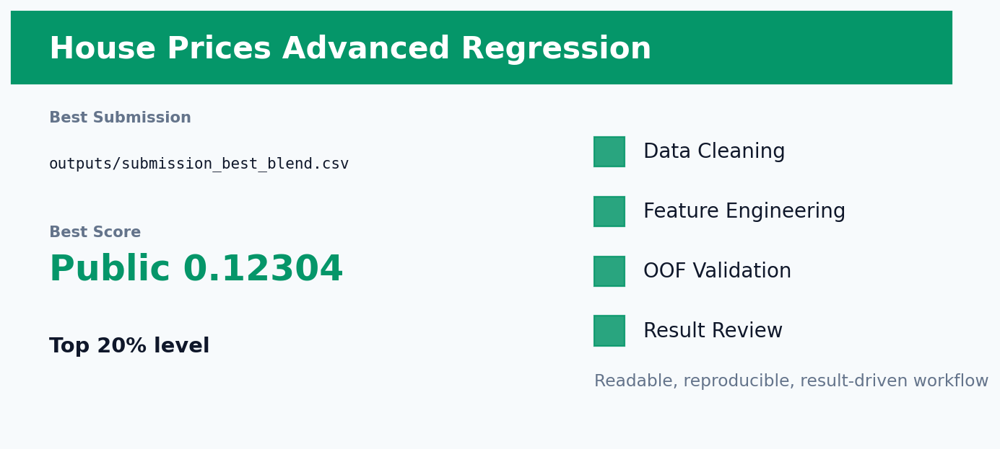

# Kaggle 房价预测



## 项目一句话

根据房屋结构、地段、质量和交易信息预测 SalePrice。

这个项目不是简单跑一个 baseline，而是围绕 **数据清洗 -> 特征工程 -> 稳定验证 -> 模型融合 -> 线上结果复盘** 做成一条完整建模链路。核心目标是：让模型不仅分数高，而且每一步为什么有效都能讲清楚。

## 当前结果

| 项目 | 内容 |
| --- | --- |
| Competition | `house-prices-advanced-regression-techniques` |
| Metric | `RMSLE / log RMSE` |
| Best Submission | `outputs/submission_best_blend.csv` |
| Best Score | Public 0.12304 |
| Validation / Extra | OOF RMSE 0.106410 |
| Status | 约前 20%，已达标 |

## 数据清洗

- 区分真正缺失与语义缺失，例如无车库、无地下室、无泳池。
- 对 SalePrice 做 log1p 变换，让模型优化更贴近 RMSLE。
- 异常点和高偏态数值特征单独处理，减少极端豪宅对整体误差的拉扯。

## 特征工程亮点

- 构造总面积、总卫浴、总门廊面积、房龄、翻新年龄等可解释特征。
- 把质量、面积、地段组合成价格感知特征，模拟买房时的真实决策逻辑。
- 对类别变量做稳健编码，同时保留 neighborhood、quality 等强信号。

这部分是项目最重要的地方：特征不是随便堆出来的，而是尽量贴近业务或数据生成逻辑。我的思路是先问“这个变量为什么会影响目标”，再把这个想法翻译成模型能理解的数值、类别、比例、交叉或序列表示。

## 模型方法

- LightGBM、XGBoost、CatBoost、Elastic/Ridge 类模型共同建模。
- 使用 OOF 预测搜索非负融合权重，避免只看单次 leaderboard。
- 最终保留多模型 OOF 优化融合。

验证上尽量使用 OOF 思路，避免只看一次线上提交。融合也不是机械平均，而是根据 OOF、public/private 表现和模型互补性来选择。

## 结果分析

- 房价任务中线性模型负责平滑趋势，树模型负责非线性和交互，融合后更稳。
- Public score 0.12304 约前 20%，说明特征工程和融合都有效。
- 继续提升的关键不是堆模型，而是更精准处理异常房源和社区差异。

## 如何复现

安装依赖：

```bash
pip install -r requirements.txt
```

复现时先从 Kaggle 下载原始数据到 README 或脚本约定的数据目录。部分仓库为了保持轻量，只保留最佳提交文件、实验日志和核心说明；如果仓库中存在 `src/`、`notebooks/` 或 `kaggle_kernel_*`，优先从这些入口运行训练。

常见入口示例：

```bash
python src/train_best.py
# 或在 Kaggle 上运行 kaggle_kernel_* 中的 GPU kernel
```

如果当前项目只保留了最佳产物，则可直接查看 `outputs/` 中的 OOF、prediction、submission 和实验摘要文件。

## 未来改进方向

- 加入更细的 Neighborhood 分层模型或目标编码的严格 OOF 版本。
- 对高价房和低价房分别做误差分析，尝试分段校准。
- 补充 SHAP/Permutation Importance 展示影响房价的核心因素。

## 项目价值

这个项目可以体现三类能力：

- **建模能力**：能从 baseline 走到调参、融合和线上验证。
- **特征工程能力**：能把业务直觉、数据分布和模型输入连接起来。
- **复盘能力**：能说明为什么涨分、为什么不涨，以及下一步该往哪里优化。
